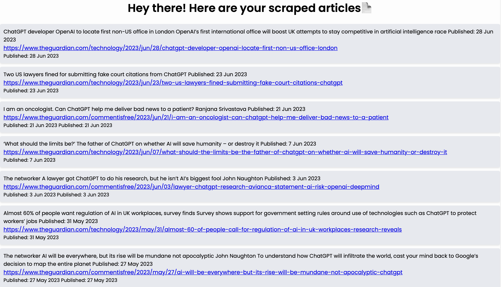

# Web Scraping Project with Node.js

This is a Node.js project for web scraping data from The Guardian website, more specifically scraping ChatGPT related news. The project retrieves information about articles related to a specific topic and applies CSS styling for presentation. Part of the project is inspired by Ania's Kubow Youtube tutorial titled: [Build a Web Scraper]((https://www.youtube.com/watch?v=-3lqUHeZs_0).

## Installation

1. Clone the repository:

   ```bash
   git clone git@github.com:brigitabi/WebScraping.git

2. Navigate to the project directory:
cd your-repository

3. Install the dependencies:
npm install

### Here is an example of scraping ChatGPT related news on Guardian.


## Usage

1. Modify the target URL and scraping logic:
Open index.js file and update the url variable to your desired Guardian URL. Adjust the scraping logic within the .each() function to match the structure of the target website and the information you want to extract.

2. Run the project: 
npm start

3. View the results: 
The project also includes a simple web server to display the scraped articles in a browser. By default, the server runs on port 8000. Open your web browser and navigate to http://localhost:8000 to view the results.
If you prefer a different port, you can modify the port variable in server.js to your desired port number. Then, access the results using the corresponding port in the URL (e.g., http://localhost:your-port-number).

## Contributing 

Pull requests are welcome. For major changes, please open an issue first to discuss what you would like to change.